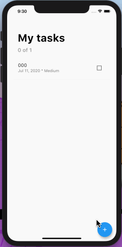
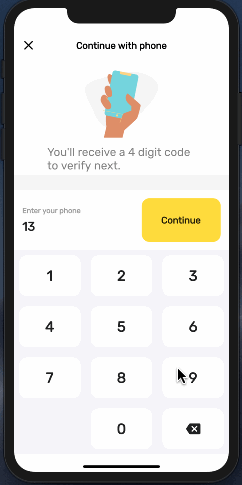

# flutter-demos

> Some demos to learn dart & flutter.

## Menus

- 📝 　 flutter_two_you
- ✅ 　 flutter_sqlite_todos
- 📝 　 flutter_ctrip
- ✅ 　 flutter_dicee
- ✅ 　 flutter_mi_card
- ✅ 　 flutter_xylophone 🎹
- ✅ 　 flutter_quizzler
- ✅ 　 flutter_bmi_calculator
- ✅ 　 flutter_phone_verification
- ✅ 　 flutter_blm_onboarding
- 🌀 　 flutter_clima
- 🌀 　 flutter_flash_chat
- 🌀 　 flutter_firebase_instagram
- 🌀 　 flutter_bloc_crypto_app
- 🌀 　 flutter_firebase_realtime_chat
- 🌀 　 flutter_focused-pop-up_menu
- ✅ 　 flutter_nike_online_store
- ✅ 　 flutter_aribnb
- ✅ 　 flutter_rotated_menu







### Notes

- `Flutter` 中怎么更新 `ListView` ？
  - 在 Android 中，View 是屏幕上显示的所有内容的基础，按钮、工具栏、输入框等一些均为 View；
  - 在 iOS 中，构建 UI 的过程中将大量使用 view 对象。这些对象都是 UIVIew 的实例。它们可以用作容器来承载其他的 UIVIew，最终构成你的界面布局；
  - 在 React Native 中， View 是一个支持 Flexbox 布局的容器，样式、触摸处理和辅助控制。
  - 在 Flutter 中，我们可以将 Widget 当作是 Android、iOS、RN 中的 View，但并不完全等价，其实 Flutter 认为 Widget 是声明和构建 UI 的方法。
  - 但 Widget 与 View 有区别。
    - 首先，Widget 具有不同的声明周期：他们是不可变的，他们会存在于状态被改变之前。每当 Widget 或其他状态发生改变时，Flutter 框架都会创建一个新的 Widget 实例树。相比之下，Android 和 iOS 视图被绘制一次，并且在调用 `invalidate/setNeedsDisplay` 之前不会重绘。
    - 此外，与 View 不同，Flutter 的 Widget 很轻巧，部分原因在于它的不可变性。因为它本身不是视图，并且不会直接绘制任何东西，而是对 UI 及其语义的描述而已。
- 不要在赤裸裸的使用 Image 组件，鬼知道它又多大，大多了就出现故障栏，要用 `Expanded` 包一下
- `Expanded` 里可以使用 `flex:2` 属性，设置它在当前行占据的比例，和 CSS-flex 里的属性类似
  - 如果都设 `flex:1` 就是一样大
  - 怪求不得，看了下继承关系：[`Object > DiagnosticableTree > Widget > ProxyWidget > ParentDataWidget<FlexParentData > Flexible > Expanded`](https://api.flutter.dev/flutter/widgets/Expanded-class.html)
- 有些时候组件自带一些属性则可以省略自己写，如 `FlatButton` 自带 `padding` 属性，我们则不需要再写
  - 怎么看这个组件原生带了额外属性，调试工具里搜关键字吧


- 代码片段快捷前缀：`stl` - `Flutter stateless widget` or `Flutter stateful widget`
- vscode-flutter 套壳快捷键：`cmd + .`，好用到耐不住嘛
- 如果不想让格式化器换行代码，就加一个 `,` 在末尾
- 容器宽度或高度占满全屏怎么办 -> `width: double.infinity`
- 关于类的构造函数的参数问题

```dart
/// 此时 colour 是可选参数，且不能以 _ 开头
class ReusableCard extends StatelessWidget {
  ReusableCard({this.colour});

  /// 此时就为必填参数了
  /// ReusableCard({@Required this.colour});
}
```

- Instance Variable = Field = Property
- 布局技巧
  - 最外层 `Column` 行组件
  - 每行先来一个 `Row` 列组件
  - 最后每行的里，再包一个 `Expanded` 撑开组件，因为中间那个沾满整行，如果两个就 50%排布


- 这里不是 `js` 了，该用枚举就用枚举吧
- dart 的三元操作符

```dart
/// 重构前
Color maleCardColour = inactiveCardColour;
  Color femaleCardColour = inactiveCardColour;

  /// 1 = male, 2 = female
  void updateColour(Gender selectedGender) {
  /// male card pressed
  if (selectedGender == Gender.male) {
    if (maleCardColour == inactiveCardColour) {
      maleCardColour = activeCardColour;
      femaleCardColour = inactiveCardColour;
    } else {
      maleCardColour = inactiveCardColour;
    }
  }

  if (selectedGender == Gender.female) {
    if (femaleCardColour == inactiveCardColour) {
      femaleCardColour = activeCardColour;
      maleCardColour = inactiveCardColour;
    } else {
      femaleCardColour = inactiveCardColour;
    }
  }
}

/// ----------------

/// 重构后
Expanded(
  child: GestureDetector(
    onTap: () {
      setState(() {
        selectedGender = Gender.female;
      });
    },
    child: ReusableCard(
      colour: selectedGender == Gender.female
          ? activeCardColour
          : inactiveCardColour,
      cardChild: IconContent(
        icon: FontAwesomeIcons.venus,
        label: 'FEMALE',
      ),
    ),
  ),
),
```

- `Controller` 级别的组件需要销毁时 `dispose()`

```dart
/// 原来是这样初始化 state
@override
void initState() {
  super.initState();
  _dateController.text = _dateFormatter.format(_date);
}

/// 这也就是生命周期函数
/// 需要把 controller 销毁
@override
dispose() {
  _dateController.dispose();
  super.dispose();
}

/// 和 js 一样，函数式编程
items: _priorities.map((String priority) {
  return DropdownMenuItem(
    value: priority,
    child: Text(
      priority,
      style: TextStyle(
        color: Colors.black,
        fontSize: 18.0,
      ),
    ),
  );
}).toList(),
```

- 人生第一个 `flutter-model`

```dart
class Task {
  int id;
  String title;
  DateTime date;
  String priority;
  int status; // 0: Incomplete, 1:Complete

  Task({this.title, this.date, this.priority, this.status});
  Task.withId({this.id, this.title, this.date, this.priority, this.status});

  Map<String, dynamic> toMap() {
    final map = Map<String, dynamic>();
    if (id != null) {
      map['id'] = id;
    }

    map['title'] = title;
    map['date'] = date.toIso8601String();
    map['priority'] = priority;
    map['status'] = status;

    return map;
  }

  factory Task.fromMap(Map<String, dynamic> map) {
    return Task.withId(
      id: map['id'],
      title: map['title'],
      date: DateTime.parse(map['date']),
      priority: map['priority'],
      status: map['status'],
    );
  }
}
```

- **鉴于 `dart` 的特殊声明式写法，记得把可重用的声明变量统一存放在 `contants.dart` 目录，统一管理了！**
  - 吐槽: `dart` 的声明竟然不需要 `export` 导出，随便搞！
- Flutter 中的 flex 布局之 baseline
  - 不加 `textBaseline` 属性就报错了

```dart
Row(
  mainAxisAlignment: MainAxisAlignment.center,
  crossAxisAlignment: CrossAxisAlignment.baseline,
  textBaseline: TextBaseline.alphabetic,
  children: <Widget>[
    Text('180', style: numberTextStyle),
    Text('cm', style: labelTextStyle),
  ],
)
```

- `flutter` 中如何改一个标准组件呢？“套壳”
  - 例如 Slider 组件要修改拖拽的圆点：`SliderTheme`
- `flutter` 中觉得 `FloatingActionButton` 不满意，自己搞一个呗
  - 发现它只是对 `RawMaterialButton` 包了一层(重写)，那我也就这样搞
  - 发现有些属性搞不定，去源码里翻翻，把需要的属性直接抄过来即可
- 来个封装的组件

```dart
class RoundIconButton extends StatelessWidget {
  RoundIconButton({@required this.icon, @required this.onPressed});

  final IconData icon;
  final Function onPressed;

  @override
  Widget build(BuildContext context) {
    return RawMaterialButton(
      child: Icon(icon),
      onPressed: onPressed,
      elevation: 6,
      constraints: BoxConstraints.tightFor(
        width: 56.0,
        height: 56.0,
      ),
      shape: CircleBorder(),
      fillColor: Color(0xFF4C4F5E),
    );
  }
}
```

- Class


- `Dart` 中 `const` 和 `final` 的区别
  - 需要确认的值
  - 不可变性的传递
  - 内存中的重复创建

```dart
/// 需要确认的值
final dt = DateTime.now();  // ✅
const dt = DateTime.now();  // ❌

/// 不可变性的传递
final List ls1 = [11,22,33];
const List ls2 = [11,22,33];
ls1[1] = 44;  // ✅
ls2[1] = 44;  // ❌

/// 内存中的重复创建
final List fls1 = [11,22,33];
final List fls2 = [11,22,33];
print(identical(fls1, fls2));  // false

const List cls1 = [11,22,33];
const List cls2 = [11,22,33];
print(identical(fls1, fls2));  // true
```

- Dart 中的默认值：一切都是 `Object`，变量声明默认都是 `null`
- Flutter 组件中 `SafeArea` 到底是啥 ?


- Flutter 获取 GPS 坐标插件：`geolocator`
- Flutter 中 Stateless 组件声明周期:
  - 1. `Widget build()`
- Flutter 中 Stateful 组件声明周期:
  - 1. `void initState()`
  - 2. `Widget build()`
  - 3. `void deactive()`
- 所以说从组件声明周期函数就能引出如果只在页面初次渲染时获取地理位置，则在 `initState()` 函数中调用即可

- HTTP Status Codes


- **`Scaffold` 组件常见属性**

```dart
const Scaffold({
  Key key,
  this.appBar,    // 应用栏，显示在顶部，包括其中的搜索框
  this.body,      // 页面的主题显示内容
  this.floatingActionButton,          // 设置显示在上层区域的按钮，默认位置位于右下角
  this.floatingActionButtonLocation,  // 设置floatingActionButton的位置
  this.floatingActionButtonAnimator, // floatingActionButton动画
  this.persistentFooterButtons,      // 在底部导航栏之上的一组操作按钮
  this.drawer,    // 左侧导航栏
  this.endDrawer, // 右侧导航栏
  this.bottomNavigationBar, // 底部导航栏
  this.bottomSheet,         // 底部可隐藏导航栏
  this.backgroundColor,     // 内容区域颜色
  this.resizeToAvoidBottomPadding, // 是否重新布局来避免底部被覆盖了，比如当键盘显示的时候，重新布局避免被键盘盖住内容。默认值为 true。
  this.resizeToAvoidBottomInset, //键盘弹出时是否重新绘制，以避免输入框被遮挡
  this.primary = true,          // 是否计算手机顶部状态栏的高度
  this.drawerDragStartBehavior = DragStartBehavior.start, // 拖动的处理
  this.extendBody = false,              // 是否延伸body至底部
  this.extendBodyBehindAppBar = false, // 是否延伸body至顶部
  this.drawerScrimColor,              // 抽屉遮罩层背景色
  this.drawerEdgeDragWidth,                 // 滑动拉出抽屉的生效距离
  this.drawerEnableOpenDragGesture = true, // 确定是否可以通过拖动手势打开Scaffold.drawer, 默认情况下，拖动手势处于启用状态
  this.endDrawerEnableOpenDragGesture = true, // 确定是否可以使用拖动手势打开Scaffold.endDrawer，默认情况下，拖动手势处于启用状态。
})
```

- Flutter **`Scaffold` 顶部导航栏实现**

```dart
return Scaffold(
  appBar: AppBar(
    title: Text('Two You'), // 页面名字
    bottom: TabBar(
      controller: _controller,
      tabs: <Widget>[
        Tab(
          icon: Icon(Icons.view_list),
          text: '推荐',
        ),
        Tab(
          icon: Icon(Icons.favorite),
          text: '关注',
        ),
        Tab(
          icon: Icon(Icons.person),
          text: '我',
        ),
      ],
    ),
  ),
  body: TabBarView(
    controller: _controller,
    children: [
      router.getPageByRouter('homepage'),
      Icon(Icons.directions_transit),
      router.getPageByRouter('userpage')
    ],
  ),
);
```

- Flutter **`BottomNavigationBar` 底部导航栏实现**

```dart
BottomNavigationBar({
  Key key,
  @required this.items, // 数组，对应于BottomNavigationBarItem这个组件为菜单栏的每一项，其中包含四个属性icon、title、activeIcon和backgroundColor
  this.onTap, // 点击触发逻辑，一般用来触发页面的跳转更新
  this.currentIndex = 0, // 当前所在的 items 数组中的位置
  this.elevation = 8.0, // 设置阴影效果值
  BottomNavigationBarType type, // fixed(固定位置)和shifting(浮动效果)
  Color fixedColor, // 代表选中时候的颜色，不能和selectedItemColor一起使用
  this.backgroundColor, // 背景颜色
  this.iconSize = 24.0, // icon 大小
  Color selectedItemColor, // 代表选中的颜色，不能和selectedItemColor一起使用
  this.unselectedItemColor, // 未选中时颜色
  this.selectedIconTheme = const IconThemeData(), // 当前选中的BottomNavigationBarItem.icon中图标的大小，不透明度和颜色
  this.unselectedIconTheme = const IconThemeData(), // 当前未选中的BottomNavigationBarItem.icon中图标的大小，不透明度和颜色
  this.selectedFontSize = 14.0, // 选中的字体大小
  this.unselectedFontSize = 12.0, // 未选中字体大小
  this.selectedLabelStyle, // 选中字体样式
  this.unselectedLabelStyle, // 未选中字体样式
  this.showSelectedLabels = true, // 是否开启选中的样式
  bool showUnselectedLabels, // 是否开启未选中的样式
})
```

- 总的来说 `Flutter` 实现所有导航方式如下(都是 Scaffold 的属性)：
  - 顶部导航栏用 `appBar`
  - 底部导航栏用 `bottomNavigationBar`
  - 边侧导航栏用 `drawer`
  - 搜索框 `AppBar.actions`
- Flutter 两个页面回传对象怎么做？
  - 1. `Navigator.push(... -> bPage())`;
  - 2. 在 bPage 做业务 `Navigator.pop(context, username)`;
  - 3. 修改 aPage `var username = await Navigator.push()`;
  - 4. 为什么可以 `await Navigator.push()` 方法？因为它是个 `Future<T> push<T extends Object>(BuildContext context, Route<T> route)`


- 如何写一个小铃铛加小圆点（通知）？
  - 那就上 `flutter` 中的 相对定位 `Stack`
  - 然后先上主元素小铃铛
  - 后面跟着被 `Positioned` 包裹的小圆点，表示绝对定位，记得写 `top` 和 `right` 即可
- Scaffold 的 appBar 不想要那个分割线或者觉得分割线不够粗？？
  - 套一个 `Material` 改 `elevation: 2` 就行了


- 如何写一个搜索框？
  - 感觉和 css 还是有点类似，做的很明显的一件事就是去边框

```dart
TextField(
  decoration: InputDecoration(
      hintText: "Search",
      hintStyle: TextStyle(
        fontSize: 18,
        color: Colors.grey[400],
        fontWeight: FontWeight.bold,
      ),
      border: OutlineInputBorder(
        borderRadius: BorderRadius.circular(15),
        borderSide: BorderSide(
          width: 0,
          style: BorderStyle.none,
        ),
      ),
      filled: true,
      fillColor: Colors.grey[200],
      contentPadding: EdgeInsets.all(20),
      prefixIcon: Padding(
        padding: EdgeInsets.only(left: 16, right: 6),
        child: Icon(
          Icons.search,
          color: Colors.grey[400],
          size: 28,
        ),
      )),
)
```

- `Column` 中分割元素就只会用 `SizedBox` 了，不会再有其他方法了

### 划鞋盒子


```dart
/// 底层纸板
path.moveTo(startFromX, 250);
path.lineTo(startFromX, 400);
path.lineTo(endToX, 400);
path.lineTo(endToX, 250);

/// 右边纸板
path.moveTo(startFromX, 250);
path.lineTo(startFromX, 400);
path.lineTo(endToX, 400);
path.lineTo(endToX, 250);
path.close();
```

## flutter_fooderlich

### Notes_footerlich

- Fun fact: Column and Row widgets are like ListView but without the scroll view.
- ListView.builder() takes in an IndexedWidgetBuilder and builds the list on demand.
  - 根据索引，按需构建，相当于虚拟滚动了
- ListView.custom() gives you more fine-grain control over your child items.

  - 细颗粒度控制列表渲染

- 就一开始就养成良好的习惯

```dart
late ScrollController _controller;

@override
void initState() {
  super.initState();
  _controller = ScrollController();
  _controller.addListener(_scrollListener);
}

void _scrollListener() {
  if (_controller.offset >= _controller.position.maxScrollExtent &&
      !_controller.position.outOfRange) {
    print('reached the bottom');
  }
  if (_controller.offset <= _controller.position.minScrollExtent &&
      !_controller.position.outOfRange) {
    print('reached the top!');
  }
}

@override
void dispose() {
  _controller.removeListener(_scrollListener);
  super.dispose();
}
```

- `ListView` 和 `GridView` 两者同时支持水平和垂直方向滚动的；
- The primary property lets Flutter know which scroll view is the primary scroll
  view.
  - 设置 primary 属性后可以告诉 Flutter 这个滚动视图时主滚动视图？有点懵，难道说给它升级，优先它的滚动了？
- Especially in a nested list view, remember to set shrinkWrap to true so you can give the scroll view a fixed height for all the items in the list.
  - 特别是在嵌套滚动时，必须给其余的 `scroll-view` 设置 `shrinkWrap: true`，否则肯定是编译不过，这样可以给这个滚动视图里的每个元素设置一个固定高度或宽度。
- Barrel files are handy to group imports together. They also let you import many widgets using a single file.

```dart
export 'post.dart';
export 'explore_recipe.dart';
export 'simple_recipe.dart';
export 'explore_data.dart';
```

### **Section II: Everything’s a Widget**

- The Scaffold widget implements all your basic visual layout structure needs.
- Scaffold 实现了你对基本视觉布局结构的所有需求！
- 嵌套的 widgets 就像很长的 staircase 一样
- 我们应该主动拆分 “嵌套地狱”，例如我们从 Scaffold 开始拆分
- 拆分出来的 home.dart 是一个 `StatefullWidget`，而顶层 widget 应该还是保持 `StatelessWidget`

```dart
class _HomeState extends State<Home> {
  // TODO: Add state variables and functions
  @override
  Widget build(BuildContext context) {
    return Scaffold(
      appBar: AppBar(
        title: Text(
          'Fooderlich',
          // 2
          style: Theme.of(context).textTheme.headline6,
        ),
      ),
      // TODO: Show selected tab
      body: Center(
        child: Text('Let\'s get cooking ! ',
            // 3
            style: Theme.of(context).textTheme.headline1),
      ),
      // TODO: Add bottom navigation bar
    );
  }
}
```

上面代码很奇葩，`theme` 从哪里来？

> Theme.of(context) returns the nearest Theme in the widget tree. If the widget has a defined Theme, it returns that. Otherwise, it returns the app’s theme.

- This function handles tapped tab bar items. Here, you set the index of the item
  that the user pressed. setState() notifies the framework that the state of this object has changed, then rebuilds this widget internally.

- Apply a padding of 16 on all sides of the box. Flutter units are specified in logical
  pixels, which are like dp on Android.
  - 在 Flutter 页面布局时用的单位是 `逻辑像素`，相当于安卓系统中的 `dp` 单位
- Apply BoxDecoration. This describes how to draw a box. 🐬
- In BoxDecoration, set up DecorationImage, which tells the box to paint an
  image.
- 如果用了 Stack 后，不做定位，你的所有组件都会从 `(0,0)` 坐标开始重叠绘制
- 在一个 `Stack` 里放一个 `Container` 时，竟然这个 `Container` 会被撑满整个组件，意料以外

### What is a widget?

> A widget is a building block for your user interface. Using widgets is like combining Legos. Like Legos, you can mix and match widgets to create something amazing.

### State object lifecycle

> Note: Asynchronous code should always check if the mounted property is true before calling setstate(), because the widget may no longer be part of the widget tree.

### InheritedWidget

> pic

- That’s where inherited widgets come in! By adding an inherited widget in your tree, you can reference the data from any of its descendants. This is known as lifting state up.
- “状态提升”

### Interactive Widgets

- Note: Remember that the purpose of a barrel file is to group common Dart files together. This allows you to group classes that are commonly used together so you only have to import a single file — in this case, models.dart.

- `Flexible` gives a child the ability to fill the available space in the main axis.
- `AspectRatio` sizes its child to the specified aspectRatio. Although aspectRatio is a double, the Flutter documentation recommends writing it as width / height instead of the calculated result. In this case, you want a square aspect ratio of 1 / 1 and not 1.0.
  - 两个小伙伴要一起用！
  - 原来设置 16 比 9 如此简单!

> Note: Dart does the calculation for you to provide the double. What if you’d wanted a 16:9 ratio? You’d put 16 / 9 and not 1.5.

### Switching tabs

> 状态管理

现在我们需要在孙子组件里点击切换 `tab`，要把这件事传递给爷爷组件，告诉它换个 TabView 渲染，我们有如下两种方式实现：

- 光从肉眼来看，必然是第二种方法号上去比较好。


- Provider overview
  - ChangeNotifier is extended by a class to provide change notifications to its listeners.
  - ChangeNotifierProvider listens for changes to a ChangeNotifier. Widgets below it can access the state object and listen to state changes.
  - Consumer wraps around part of a widget tree. It rebuilds part of a subtree when the state it listens to changes.
  - Provider.of allows descendant widgets to access the state object. If you only need access to the state object and don’t need to listen for changes, `use this` 😂 用它!

```dart
Widget build(BuildContext context) {
  return Consumer<TabManager>(
    builder: (context, tabManager, child) {
      return Scaffold(
        appBar: AppBar(title: Text('Fooderlich')),
        body: pages[tabManager.selectedTab],
        bottomNavigationBar: BottomNavigationBar(
          currentIndex: tabManager.selectedTab,
          onTap: tabManager.goToTab,
          items: [],
        ),
      );
    },
  );
}
```

- 注意以下几点：
  - Wraps all the widgets inside Consumer. When TabManager changes, the widgets below it will rebuild.
  - Displays the correct page widget, based on the current tab index.


```dart
return Dismissible(
  key: Key(item.id),
  direction: DismissDirection.endToStart,
  onDismissed: (direction) {
    manager.deleteItem(index);
    ScaffoldMessenger.of(context).showSnackBar(
        SnackBar(content: Text('${item.name} dismissed')));
```

- ⭐️ The dismissible widget includes a Key. Flutter needs this to find and remove the right element in the tree.

```dart
Navigator.push(
  context,
  MaterialPageRoute(
    builder: (context) => GroceryItemScreen(
      onCreate: (item) {
        manager.addItem(item);
        Navigator.pop(context);
      },
      onUpdate: (item) {},
    ),
  ),
);
```

- ↑ ↑ `imperative style`
- But this uses the imperative style of navigation, known as Navigator 1.0. In this chapter, you’ll learn to navigate between screens the declarative way.
- A stack is a data structure that manages pages. You insert the elements last-in, first- out (LIFO), and only the element at the top of the stack is visible to the user. `描述的很优美`
- Before the release of Flutter 1.22, you could only shift between screens by issuing direct commands like “show this now” or “remove the current screen and go back to the previous one”. `·😂 有意思 😂·`


- `Navigator 2.0`
- A user taps on a button.
- The button handler tells the app state to update.
- The router is a listener of the state, so it receives a notification when the state changes.
- Based on the new state changes, the router reconfigures the list of pages for the navigator.
- Navigator detects if there’s a new page in the list and handles the transitions to show the page.

```dart
class FooderlichTab {
  static const int explore = 0;
  static const int recipes = 0;
  static const int toBuy = 0;
}
```

> 写了 `AppStateManager` 有点感觉了，原来我们不再是原来 `1.0` 那种 `push/pop`，而是构建全局的 `AppState` 来驱动 `Router` 去配置 `Navigator` 来构建 `route`
>
> 不再是原来憨憨的 `教条式`
>
> 我晕，竟然又是 “事件驱动”，到了哪里都有老哥的 “身影” 😅

```dart
class AppStateManager extends ChangeNotifier {
  bool _initialized = false;
  bool _loggedIn = false;
  bool _onboardingComplete = false;
  int _selectedTab = FooderlichTab.explore;

  bool get isInitialized => _initialized;
  bool get isLoggedIn => _loggedIn;
  bool get isOnboardingComplete => _onboardingComplete;
  int get getSelectedTab => _selectedTab;

  void initializeApp() {
    Timer(const Duration(milliseconds: 2000), () {
      _initialized = true;
      notifyListeners();
    });
  }

  void login(String username, String password) {
    _loggedIn = true;
    notifyListeners();
  }

  void completeOnboarding() {
    _onboardingComplete = true;
    notifyListeners();
  }

  void goToTab(index) {
    _selectedTab = index;
    notifyListeners();
  }

  void goToRecipes() {
    _selectedTab = FooderlichTab.recipes;
    notifyListeners();
  }

  void logout() {
    _loggedIn = false;
    _onboardingComplete = false;
    _initialized = false;
    _selectedTab = 0;

    initializeApp();
    notifyListeners();
  }
}
```

> 果真，代码不会骗人。
>
> 跪了 -> “事件驱动”

### router widget

1. It extends RouterDelegate. The system will tell the router to build and configure a navigator widget.
2. Declares GlobalKey, a unique key across the entire app.
3. Declares AppStateManager. The router will listen to app state changes to
   configure the navigator’s list of pages.
4. Declares GroceryManager to listen to the user’s state when you create or edit an item.
5. Declares ProfileManager to listen to the user profile state.
6. ⭐️[**划线**]⭐️ RouterDelegate requires you to add a build(). This configures your navigator
   and pages.
7. Configures a Navigator.
8. Uses the navigatorKey, which is required to retrieve the current navigator.
9. Declares pages, the stack of pages that describes your navigation stack.
10. Sets setNewRoutePath to null since you aren’t supporting Flutter web apps yet. Don’t worry about that for now, you’ll learn more about that topic in the next chapter.

> 一种集中路由和事件驱动，有点总线的感觉。
>
> 既然是 Widget 的子类，那肯定要有 `Widget build() {}` 方法！
>
> 是的，既然在集中管理了，`pop` 时需要考虑的事情就很多。到底能不能返回，看我的！

```dart
bool _handlePopPage(Route<dynamic> route, result) {
  if (!route.didPop(result)) {
    return false;
  }
  // TODO: Handle Onboarding and splash
  // TODO: Handle state when user closes grocery item screen
  // TODO: Handle state when user closes profile screen
  // TODO: Handle state when user closes WebView screen
  return true;
}
```

```dart
return MaterialApp(
  theme: theme,
  title: 'Fooderlich',
  home: Router(
    routerDelegate: _appRouter,
    // TODO: Add backButtonDispatcher
  ),
);
```

> 从此以后，渲染啥就被代理人这个精神小伙接管。
>
> 说真的：“事件驱动”、“响应式编程” 大法真是好。🤘🤘🤘

### declarative VS imperative

> 指令式路由 VS 声明式路由
>
> 声明式路由逻辑真的完胜！

```dart
Widget build(BuildContext context) {
  var index = getPageIndex(pages, routeStatus);

  List<MaterialPage> tempPages = pages;
  if (index != -1) {
    // 要打开的页面在栈中已存在，则将该页面和它上面的所有页面进行出栈
    // tips 具体规则可以根据需要进行调整，这里要求栈中只允许有一个同样的页面实例
    tempPages = tempPages.sublist(0, index);
  }

  var page;
  if (routeStatus == RouteStatus.home) {
    // 跳转到首页时，需将栈中其他页面进行出栈，因为首页是不可回退的
    pages.clear();
    // page = pageWrap(HomePage());
    page = pageWrap(BottomNavigator());
  } else if (routeStatus == RouteStatus.darkMode) {
    page = pageWrap(DarkModePage());
  } else if (routeStatus == RouteStatus.detail) {
    page = pageWrap(VideoDetailPage(videoModel!));
  } else if (routeStatus == RouteStatus.registration) {
    page = pageWrap(RegistrationPage());
  } else if (routeStatus == RouteStatus.login) {
    page = pageWrap(LoginPage());
  }

  // 重新创建一个数组，否则 pages 因引用没有改变理由不会生效
  tempPages = [...tempPages, page];
  pages = tempPages;

  // fix: 修复Android物理按返回键，无法返回上一页的问题
  return WillPopScope(
    onWillPop: () async =>
        !(await navigatorKey.currentState?.maybePop() ?? false),
    child: Navigator(
      key: navigatorKey,
      pages: pages,
      onPopPage: (route, result) {
        // 如果没有登录，而又在登录页，此时就提示登录，不给返回
        // 因为该APP必须登录后才能用
        if (route.settings is MaterialPage) {
          if ((route.settings as MaterialPage).child is LoginPage) {
            if (!hasLogin) {
              showWarnToast("请先登录");
              return false;
            }
          }
        }

        // 在这里可以控制是否可以返回
        if (!route.didPop(result)) {
          return false;
        }

        // 如果返回了上一页，必须将路由栈出栈
        // 因为栈是先进后出，第一个进栈的肯定压在最底下
        // 所以要出栈最后一个入栈的路由
        pages.removeLast();
        // 没啥条件限制了，可以返回了
        return true;
      },
    ),
  );
}
```

```dart
class _HomeState extends State<Home> {
  static List<Widget> pages = <Widget>[
    ExploreScreen(),
    RecipesScreen(),
    const GroceryScreen(),
  ];

  @override
  Widget build(BuildContext context) {
    return Consumer<AppStateManager>(
      builder: (context, appStateManager, child) {
        return Scaffold(
          appBar: AppBar(
            title: Text(
              'Fooderlich',
              style: Theme.of(context).textTheme.headline6,
            ),
            actions: [
              profileButton(),
            ],
          ),
          body: IndexedStack(index: widget.currentTab, children: pages),
          bottomNavigationBar: BottomNavigationBar(
            selectedItemColor:
                Theme.of(context).textSelectionTheme.selectionColor,
            currentIndex: widget.currentTab,
            onTap: (index) {
              Provider.of<AppStateManager>(context, listen: false)
                  .goToTab(index);
            },
            items: <BottomNavigationBarItem>[
              const BottomNavigationBarItem(
                icon: Icon(Icons.explore),
                label: 'Explore',
              ),
              const BottomNavigationBarItem(
                icon: Icon(Icons.book),
                label: 'Recipes',
              ),
              const BottomNavigationBarItem(
                icon: Icon(Icons.list),
                label: 'To Buy',
              ),
            ],
          ),
        );
      },
    );
  }
}
```

- 通过给每个页面单独配置 `MaterialPage Helper`，不仅可以让该页面容器摆脱全局状态的魔爪，让其成为一个纯函数，而且首次渲染只与输入有关，逻辑关系将很透明，依赖也变得透明了
- 当然内部组件很有可能与全局状态关联，那就做成局部渲染吧

### Deep Links


- Types of deep links
  - `URI schemes`: An app’s own URI scheme. `fooderlich://ray.com/home`
  - `iOS Universal Links`: In the root of your web domain, you place a file that points to a specific app ID to know whether to open your app or to direct the user to the App Store.
  - `Android App Links`: These are like iOS Universal Links, but for the Android platform.

#### Setting up deep links on iOS

- `ios/Runner/Info.plist`
  - CFBundleURLName is a unique URL that distinguishes your app from others that use the same scheme. fooderlich is the name of the URL scheme you’ll use later.

```xml
<key>FlutterDeepLinkingEnabled</key>
<true/>
<key>CFBundleURLTypes</key>
<array>
  <dict>
  <key>CFBundleTypeRole</key>
  <string>Editor</string>
  <key>CFBundleURLName</key>
  <string>raywenderlich.com</string>
  <key>CFBundleURLSchemes</key>
  <array>
  <string>fooderlich</string>
  </array>
  </dict>
</array>
```

#### Setting up deep links on Android

- `android/app/src/main/AndroidManifest.xml`

```xml
<!-- Deep linking -->
<meta-data android:name="flutter_deeplinking_enabled"
android:value="true" />
<intent-filter>
<action android:name="android.intent.action.VIEW" />
<category android:name="android.intent.category.DEFAULT" />
<category android:name="android.intent.category.BROWSABLE" />
<data
  android:scheme="fooderlich"
  android:host="raywenderlich.com" />
</intent-filter>
```


```bash
~/Library/Android/sdk/platform-tools/adb shell am start -a android.intent.action.VIEW \
-c android.intent.category.BROWSABLE \
-d 'fooderlich://raywenderlich.com/home?tab=1'

~/Library/Android/sdk/platform-tools/adb shell am start -a android.intent.action.VIEW \
-c android.intent.category.BROWSABLE \
-d 'fooderlich://raywenderlich.com/profile'
```


> deep links 舒坦！
>
> 自此，三路全通。

- 自动生成 `model`
- `flutter pub run build_runner build`

> `'package:flutter/services.dart'` 这个库属实有点强。

### Chooper

```dart
// 1
abstract class Result<T> {
}
// 2
class Success<T> extends Result<T> {
  final T value;
  Success(this.value);
}
// 3
class Error<T> extends Result<T> {
  final Exception exception;
  Error(this.exception);
}
```

- Created an abstract class. It’s a simple blueprint for a result with a generic type T.
- Created the Success class to extend Result and hold a value when the response is successful. This could hold JSON data, for example.
- Created the Error class to extend Result and hold an exception. This will model errors that occur during an HTTP call, like using the wrong credentials or trying to fetch data without authorization.

```dart
@ChopperApi()
abstract class RecipeService extends ChopperService {
  @Get(path: 'search')
  Future<Response<Result<APIRecipeQuery>>> queryRecipes(
      @Query('q') String query,
      @Query('from') int from,
      @Query('to') int to);
}
```

- `@ChopperApi()` 它会告诉 `Chopper` 帮我生成一个 `part` 文件。在当前场景中，会自动生成 `recipe_service.chopper.dart` 模板代码文件。
- 注意📢 `RecipeService` 它只是一个 `抽象类` ，我们只需要定义一些方法签名就行，剩下的交给脚本跑模板代码即可，妥妥的 👌
- `@Get`注解，我更喜欢叫他 `装饰器`，它会告诉装饰器这个方法是个 Get request ，然后也支持其他 HTTP Mthod，还有在方法参数前加的 `@Query` 装饰器可以省略我们自己手动拼接模板字符串，直接定义和拼接二合一了
  - `'$apiUrl?app_id=$apiId&app_key=$apiKey&q=$query&from=$from&to=$to');`
- 这个方法签名的泛型有点凶：`Future<Response<Result<APIRecipeQuery>>>`，当然这个也是返回的类型
- 对了使用了注解还可以限制函数的输入类型，真是一举两得

```dart
class ModelConverter implements Converter {
  @override
  Request convertRequest(Request request) {
    final req = applyHeader(
      request,
      contentTypeKey,
      jsonHeaders,
      override: false,
    );
    return encodeJson(req);
  }

  Request encodeJson(Request request) {}
  Response decodeJson<BodyType, InnerType>(Response response) {}

  @override
  Response<BodyType> convertResponse<BodyType, InnerType>(Response response) {}
}
```

- 我们通过重写  Chopper Converter 的 `convertRequest` 抽象类，我们可以修改发送的请求头
- 接收 request ，然后用 `applyHeader` 加工这个请求头再返回 `this` 链式调用

```dart
Response<BodyType> decodeJson<BodyType, InnerType>(Response response) {
  final contentType = response.headers[contentTypeKey];
  var body = response.body;
  if (contentType != null && contentType.contains(jsonHeaders)) {
    body = utf8.decode(response.bodyBytes);
  }
  try {
    final mapData = json.decode(body);
    if (mapData['status'] != null) {
      return response.copyWith<BodyType>(
          body: Error(Exception(mapData['status'])) as BodyType);
    }
    final recipeQuery = APIRecipeQuery.fromJson(mapData);
    return response.copyWith<BodyType>(
        body: Success(recipeQuery) as BodyType);
  } catch (e) {
    chopperLogger.warning(e);
    return response.copyWith<BodyType>(
        body: Error(e as Exception) as BodyType);
  }
}
```

```dart
static RecipeService create() {
  final client = ChopperClient(
    baseUrl: apiUrl,
    interceptors: [_addQuery, HttpLoggingInterceptor()],
    converter: ModelConverter(),
    errorConverter: const JsonConverter(),
    services: [
      _$RecipeService(),
    ],
  );
  return _$RecipeService(client);
}
```

> 原来之前所做的一切，都在为它服务。

### Deployment

#### Platform Specific App Assets

#### Build & Release an Android App

#### Build & Release an iOS App
