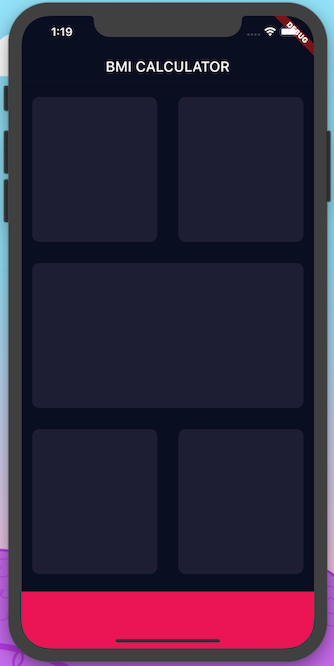

# flutter-demos

## Menus

- flutter_two_you
- flutter_sqlite_todos
- flutter_ctrip
- flutter_bmi_calculator
- flutter_clima
- flutter_flash_chat


## Notes

- 代码片段快捷前缀：`stl` - `Flutter stateless widget` or `Flutter stateful widget`
- vscode-flutter 套壳快捷键：`cmd + .`，好用到耐不住嘛
- 如果不想让格式化器换行代码，就加一个 `,` 在末尾
- 容器宽度或高度占满全屏怎么办 -> `width: double.infinity`
- `Flutter` 中怎么更新 `ListView` ？
- 关于类的构造函数的参数问题

```dart
/// 此时 colour 是可选参数，且不能以 _ 开头
class ReusableCard extends StatelessWidget {
  ReusableCard({this.colour});

  /// 此时就为必填参数了
  /// ReusableCard({@Required this.colour});
}
```

- Instance Variable = Field = Property
- 布局技巧
  - 最外层 `Column` 行组件
  - 每行先来一个 `Row` 列组件
  - 最后每行的里，再包一个 `Expanded` 撑开组件，因为中间那个沾满整行，如果两个就50%排布



- 这里不是 `js` 了，该用枚举就用枚举吧
- dart 的三元操作符

```dart
/// 重构前
Color maleCardColour = inactiveCardColour;
  Color femaleCardColour = inactiveCardColour;

  /// 1 = male, 2 = female
  void updateColour(Gender selectedGender) {
    /// male card pressed
    if (selectedGender == Gender.male) {
      if (maleCardColour == inactiveCardColour) {
        maleCardColour = activeCardColour;
        femaleCardColour = inactiveCardColour;
      } else {
        maleCardColour = inactiveCardColour;
      }
    }

    if (selectedGender == Gender.female) {
      if (femaleCardColour == inactiveCardColour) {
        femaleCardColour = activeCardColour;
        maleCardColour = inactiveCardColour;
      } else {
        femaleCardColour = inactiveCardColour;
      }
    }
  }
}

/// ----------------

/// 重构后
Expanded(
  child: GestureDetector(
    onTap: () {
      setState(() {
        selectedGender = Gender.female;
      });
    },
    child: ReusableCard(
      colour: selectedGender == Gender.female
          ? activeCardColour
          : inactiveCardColour,
      cardChild: IconContent(
        icon: FontAwesomeIcons.venus,
        label: 'FEMALE',
      ),
    ),
  ),
),
```

```dart
/// 原来是这样初始化 state
@override
void initState() {
  super.initState();
  _dateController.text = _dateFormatter.format(_date);
}

/// 这也就是生命周期函数
/// 需要把 controller 销毁
@override
dispose() {
  _dateController.dispose();
  super.dispose();
}

/// 和 js 一样，函数式编程
items: _priorities.map((String priority) {
  return DropdownMenuItem(
    value: priority,
    child: Text(
      priority,
      style: TextStyle(
        color: Colors.black,
        fontSize: 18.0,
      ),
    ),
  );
}).toList(),
```

- 人生第一个 `flutter-model`

```dart
class Task {
  int id;
  String title;
  DateTime date;
  String priority;
  int status; // 0: Incomplete, 1:Complete

  Task({this.title, this.date, this.priority, this.status});
  Task.withId({this.id, this.title, this.date, this.priority, this.status});

  Map<String, dynamic> toMap() {
    final map = Map<String, dynamic>();
    if (id != null) {
      map['id'] = id;
    }

    map['title'] = title;
    map['date'] = date.toIso8601String();
    map['priority'] = priority;
    map['status'] = status;

    return map;
  }

  factory Task.fromMap(Map<String, dynamic> map) {
    return Task.withId(
      id: map['id'],
      title: map['title'],
      date: DateTime.parse(map['date']),
      priority: map['priority'],
      status: map['status'],
    );
  }
}
```

- **鉴于 `dart` 的特殊声明式写法，记得把可重用的声明变量统一存放在 `contants.dart` 目录，统一管理了！**
  - 吐槽: `dart` 的声明竟然不需要 `export` 导出，随便搞！
- Flutter 中的 flex 布局之 baseline
  - 不加 `textBaseline` 属性就报错了

```dart
Row(
  mainAxisAlignment: MainAxisAlignment.center,
  crossAxisAlignment: CrossAxisAlignment.baseline,
  textBaseline: TextBaseline.alphabetic,
  children: <Widget>[
    Text('180', style: numberTextStyle),
    Text('cm', style: labelTextStyle),
  ],
)
```

- `flutter` 中如何改一个标准组件呢？“套壳”
  - 例如 Slider 组件要修改拖拽的圆点：`SliderTheme`
- `flutter` 中觉得 `FloatingActionButton` 不满意，自己搞一个呗
  - 发现它只是对 `RawMaterialButton` 包了一层(重写)，那我也就这样搞
  - 发现有些属性搞不定，去源码里翻翻，把需要的属性直接抄过来即可
- 来个封装的组件

```dart
class RoundIconButton extends StatelessWidget {
  RoundIconButton({@required this.icon, @required this.onPressed});

  final IconData icon;
  final Function onPressed;

  @override
  Widget build(BuildContext context) {
    return RawMaterialButton(
      child: Icon(icon),
      onPressed: onPressed,
      elevation: 6,
      constraints: BoxConstraints.tightFor(
        width: 56.0,
        height: 56.0,
      ),
      shape: CircleBorder(),
      fillColor: Color(0xFF4C4F5E),
    );
  }
}
```
